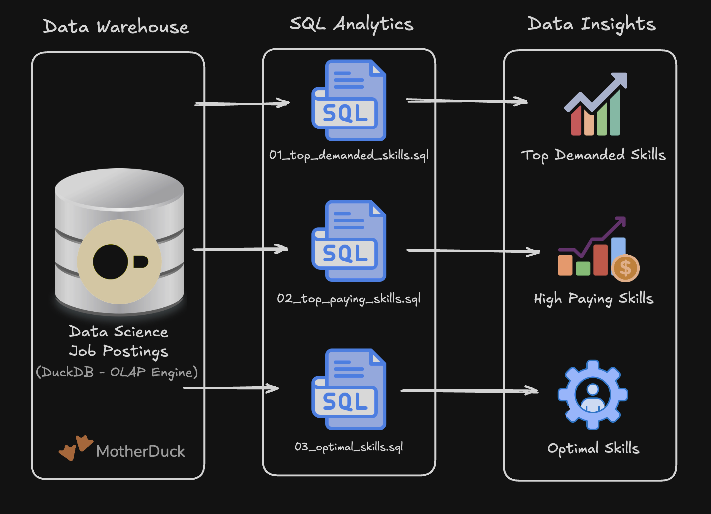

# Exploratory Data Analysis with SQL:Job Market Analysis


))  

A SQL project analysing the data engineer job market using real world job posting data. It demonstrates my ability to **write production-quality analytical SQL, design efficient queries, and turn business questions into data-driven insights**.

## Executive Summary
* ✅ **Project scope:** Built 3 analytical queries that answer key questions about the data engineer job market  
* ✅ **Data modeling:** Used multi-table joins across fact and dimension tables to extract insights  
* ✅ **Analytics:** Applied aggregations, filtering, and sorting to find top skills by demand, salary, and overall value  
* ✅ **Outcomes:** Delivered actionable insights on SQL dominance, cloud trends, and salary patterns

If you only have a minute, review these

[Top Demanded Skills Query](/Lessons/1_Topskills.sql)


## Problem & Context

## Tech Stack

## Analysis Overview

## SQL Skills Demonstrated

```SQL
SELECT * FROM skills_job_dim limit 6;

SELECT sd.skills, COUNT(jpf.job_id) AS total_count
FROM skills_dim AS sd 
LEFT JOIN skills_job_dim AS sjd 
ON sd.skill_id = sjd.skill_id
LEFT JOIN job_postings_fact AS jpf
ON sjd.job_id = jpf.job_id
WHERE job_title_short = 'Data Engineer' AND  job_location LIKE '%UK%' 
GROUP BY sd.skills
ORDER BY total_count DESC
limit 10;
```


